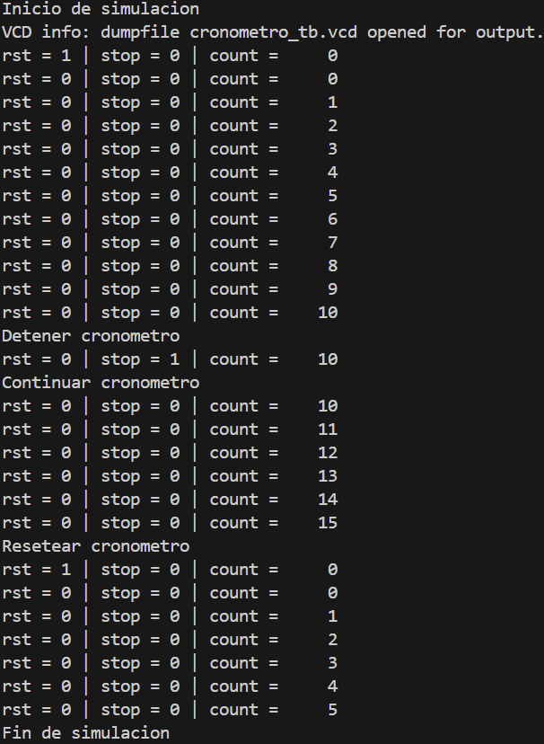
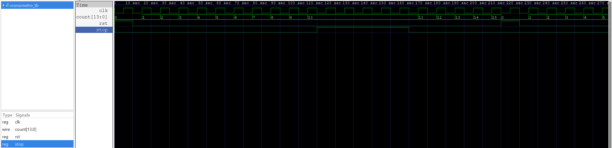
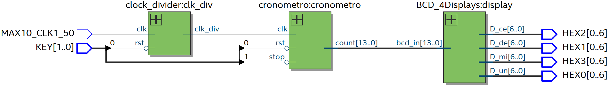
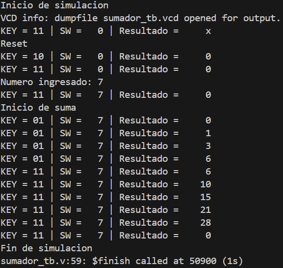
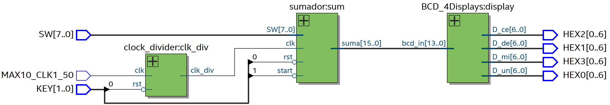

# Examen Argumentativo

---

# Cronómetro

## cronometro_wr.v

El módulo wrapper conecta los botones y el reloj de la FPGA con el sistema del cronómetro. Incluye el divisor de frecuencia, el módulo del cronómetro y la visualización en los displays de 7 segmentos.

```verilog
module cronometro_wr (

	input MAX10_CLK1_50,
	input [1:0] KEY,

	output [0:6] HEX0,
	output [0:6] HEX1,
	output [0:6] HEX2,
	output [0:6] HEX3

);

	wire rst;
	wire stop;
	wire slow_clk;

	wire [13:0] count;

	assign rst  = ~KEY[0];
	assign stop = ~KEY[1];

	clock_divider #(.FREQ(1000)) clk_div (
	    .clk(MAX10_CLK1_50),
		.rst(rst),
		.clk_div(slow_clk)
	);

	cronometro #(.MS_MAX(99), .SEC_MAX(59)) cronometro (
		.clk(slow_clk),
		.rst(rst),
		.stop(stop),
		.count(count)
	);

	BCD_4Displays display (
		.bcd_in(count),
		.D_un(HEX0),
		.D_de(HEX1),
		.D_ce(HEX2),
		.D_mi(HEX3)
	);

endmodule
```

---

## cronometro.v

Este módulo implementa el funcionamiento del cronómetro. Cuenta milisegundos y segundos hasta alcanzar los valores máximos definidos por los parámetros.

```verilog
module cronometro #(parameter MS_MAX  = 99, parameter SEC_MAX = 59) (

    input clk,
    input rst,
    input stop,

    output reg [13:0] count

);

    reg [6:0] ms;
    reg [5:0] sec;

    always @(posedge clk or posedge rst)
		begin
			if (rst)
				begin
					ms  <= 0;
					sec <= 0;
				end

			else if (!stop)
				begin
					if (ms == MS_MAX)
						begin
							ms <= 0;
							if (sec == SEC_MAX)
								sec <= 0;
							else
								sec <= sec + 1;
						end
					else
						ms <= ms + 1;
				end
		 end

    always @(*)
		begin
			count = sec * 100 + ms;
		end

endmodule
```

---

## cronometro_tb.v

El testbench verifica el funcionamiento del cronómetro probando reset, detener y continuar el conteo.

```verilog
module cronometro_tb ();

    reg clk;
    reg rst;
    reg stop;
    wire [13:0] count;

    cronometro #(.MS_MAX(99), .SEC_MAX(59)) dut (
        .clk(clk),
        .rst(rst),
        .stop(stop),
        .count(count)
    );

    initial
        clk = 0;

    always
        #5 clk = ~clk;

    initial
        begin
            rst = 1;
            stop = 0;

            $display("Inicio de simulacion");
            $monitor("rst = %b | stop = %b | count = %d", rst, stop, count);

            #10;
            rst = 0;

            #100;
            $display("Detener cronometro");
            stop = 1;

            #50;
            $display("Continuar cronometro");
            stop = 0;

            #50;
            $display("Resetear cronometro");
            rst = 1;

            #10;
            rst = 0;

            #50

            $display("Fin de simulacion");
            $finish;
        end

    initial
        begin
            $dumpfile("cronometro_tb.vcd");
            $dumpvars(0, cronometro_tb);
        end

endmodule
```

---

## Testbench



---

## Simulación del testbench



---

## RTL



---

## Prueba en la tarjeta FPGA

[Ver video de la prueba](Cronometro.mp4)

---

# Sumador

## sumador_wr.v

El módulo wrapper conecta los switches y botones de la FPGA con el sistema del sumador.

```verilog
module sumador_wr (

	input MAX10_CLK1_50,
	input [7:0] SW,    
    input [1:0] KEY,

    output [0:6] HEX0,
    output [0:6] HEX1,
    output [0:6] HEX2,
    output [0:6] HEX3

);

	wire rst;
	wire start;
	wire slow_clk;
	wire [15:0] resultado;

	assign rst = ~KEY[0];   
    assign start = ~KEY[1];
	
	clock_divider #(.FREQ(1)) clk_div (
		.clk(MAX10_CLK1_50), 
        .rst(rst), 
        .clk_div(slow_clk)
    );
	
	sumador sum (
		.clk(slow_clk),
		.rst(rst),
		.start(start),
		.SW(SW),
		.suma(resultado)
	);
    
	BCD_4Displays display (
		.bcd_in(resultado), 
        .D_un(HEX0), 
        .D_de(HEX1), 
        .D_ce(HEX2), 
        .D_mi(HEX3)
   );

endmodule
```

---

## sumador.v

Este módulo implementa una máquina de estados finitos (FSM) que realiza la suma acumulativa desde 1 hasta el número ingresado por los switches. 

```verilog
module sumador (

	input clk,
	input rst,
	input start,
	input [7:0] SW,
	output reg [15:0] suma

);

	reg [7:0] i;
	reg [1:0] current_state;
	reg [1:0] next_state;
	
	parameter IDLE = 2'd0, SUMA = 2'd1, TERMINADO = 2'd2;
	
	
	always @(posedge clk or posedge rst)
		begin
			if (rst)
				begin
					current_state <= IDLE;
				end
			else
				begin
					current_state <= next_state;
				end
		end
		
	always @(*)
		begin
			case (current_state)
				IDLE:
					begin
						if (start == 1)
							next_state <= SUMA;
						else
							next_state <= IDLE;
					end
				SUMA:
					begin
						if (i > SW)
							next_state <= TERMINADO;
						else
							next_state <= SUMA;
					end
				TERMINADO:
					begin
						if (!start)
							next_state <= IDLE;
						else
							next_state <= TERMINADO;
					end
				default: next_state <= IDLE;
			endcase
		end
		
	always @(posedge clk or posedge rst)
		begin
			if (rst)
				begin
					suma <= 16'd0;
					i <= 8'd0;
				end
			else
				begin
					case (current_state)
						IDLE:
							begin
								suma <= {8'd0, SW};
								i <= 8'd0;
							end
						SUMA:
							begin
								if (i == 0)
									begin
										suma <= 16'd0;
										i <= 8'd1;
									end
								else if (i <= SW)
									begin
										suma <= suma + i;
										i <= i + 1;
									end
								else
									begin
										suma <= suma;
										i <= i;
									end
							end
						TERMINADO:
							begin
								suma <= suma;
							end
					endcase
				end
		end

endmodule
```

---

## Testbench



---

## RTL



---

## Prueba en la tarjeta FPGA

Durante la ejecución con la tarjeta, se inicializaba en 15 y los primeros 4 switches se quedaban muertos, entonces el sumador quedó empezando del número 15 al 255. En mi caso probé el valor mínimo con 15 y el resultado fue 120. En el testbench si funcionó entonces no se si hubo algún error con la tarjeta o si los pines estaban mal asignados en el archivo tcl.

[Ver video de la prueba](Sumador.mp4)

---

# Módulos Compartidos

## clock_divider.v

```verilog
module clock_divider #(parameter FREQ = 1) (

    input clk,
    input rst,
    output reg clk_div

);

    parameter CLK_FREQ = 50000000;
    parameter COUNT_MAX = (CLK_FREQ / (2 * FREQ));

    reg [31:0] count;

    always @(posedge clk)
        begin
            if (rst == 1'b1)
                begin
                    count <= 32'b0;
                end
            else if (count == COUNT_MAX - 1)
                begin
                    count <= 32'b0;
                end
            else
                begin
                    count <= count + 1;
                end
        end

    always @(posedge clk)
        begin
            if (rst == 1'b1)
                begin
                    clk_div <= 1'b0;
                end
            else if (count == COUNT_MAX - 1)
                begin
                    clk_div <= ~clk_div;
                end
        end

endmodule
```

---

## BCD_4Displays.v

```verilog
module BCD_4Displays #(parameter N_in = 16, N_out = 7) (

    input [N_in - 1:0] bcd_in,
    output [N_out - 1:0] D_un, D_de, D_ce, D_mi,
    output [3:0] unidades, decenas, centenas, millares
    
);

    assign unidades = bcd_in % 10;
    assign decenas = (bcd_in / 10) % 10;
    assign centenas = (bcd_in / 100) % 10;
    assign millares = (bcd_in / 1000) % 10;

    BCD_module Unidades (
        .bcd_in(unidades), 
        .bcd_out(D_un)
    );

    BCD_module Decenas (
        .bcd_in(decenas), 
        .bcd_out(D_de)
    );

    BCD_module Centenas (
        .bcd_in(centenas), 
        .bcd_out(D_ce)
    );

    BCD_module Millares (
        .bcd_in(millares), 
        .bcd_out(D_mi)
    );

endmodule
```

---

## BCD_module.v

```verilog
module BCD_module (

	input  [3:0] bcd_in,
	output reg [6:0] bcd_out

);

	always @(*) 
		begin
			case (bcd_in)
				4'b0000:bcd_out = ~7'b1111110;
				4'b0001:bcd_out = ~7'b0110000;
				4'b0010:bcd_out = ~7'b1101101;
				4'b0011:bcd_out = ~7'b1111001;
				4'b0100:bcd_out = ~7'b0110011;
				4'b0101:bcd_out = ~7'b1011011;
				4'b0110:bcd_out = ~7'b1011111;
				4'b0111:bcd_out = ~7'b1110000;
				4'b1000:bcd_out = ~7'b1111111;
				4'b1001:bcd_out = ~7'b1111011;
				default:bcd_out = ~7'b0000000;
			endcase
		end
	
endmodule
```
